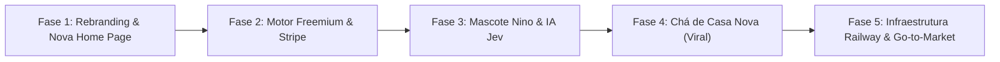

# Plano Faseado de Implementações Futuras: Casa Mia

> **Objetivo:** Estabelecer o roteiro técnico e de produto para transformar a base de código atual no aplicativo comercial do **Casa Mia**, com arquitetura Freemium, integração de pagamentos Stripe, motor de IA Jev (TypeSafe AI), mascote Nino e a página pública de Chá de Casa Nova.

---

## 1. Diagnóstico do Estado Atual da Aplicação

### O que já existe hoje no código
* **Estrutura de Domínio de Enxoval:** cadastro de ambientes/cômodos (`src/components/EnvironmentList.tsx`, `WorkspaceOverview.tsx`), CRUD de itens com status e quantidades (`AddItemModal.tsx`, `ItemRow.tsx`, `data.ts`), cálculo básico de orçamento total e gasto.
* **Ferramentas Utilitárias:** exportação e importação de listas em planilhas Excel e CSV (`src/utils/export.ts`, `src/utils/importItems.ts`).
* **Onboarding Estruturado:** funil de boas-vindas com perfil de moradia, preferências e catálogo inicial de sugestões (`src/components/onboarding/OnboardingFlow.tsx`, `src/onboarding/catalog.ts`).
* **Autenticação e Backend:** rotas de login, cadastro, recuperação de senha com tokens seguros, suporte a PostgreSQL e SQLite (`server/database.ts`, `server/routes.ts`, `server/security.ts`), envio de e-mails transacionais via Resend (`server/mailer.ts`).
* **Área Administrativa:** gestão básica de contas e permissões (`src/components/AdminPage.tsx`, `server/admin.ts`).

### O que NÃO existe e precisa ser implementado
1. **Identidade Visual e Marca:** o código atual ainda utiliza os assets e textos da marca antiga "Larume" (`src/components/Brand.tsx`, `LandingPage.tsx`, `product.css`, favicons e imagens).
2. **Página Principal (Home Page):** a `LandingPage.tsx` precisa ser 100% reconstruída com a paleta terracota/creme, o mascote Nino, o conceito de enxoval inteligente e a nova tabela de planos.
3. **Regras e Travas de Freemium:** atualmente qualquer usuário pode criar cômodos e itens ilimitados sem restrição.
4. **Motor de Pagamentos:** não há conexão ativa com a Stripe para cobrança recorrente, checkout ou portal de autoatendimento do cliente.
5. **Inteligência Artificial (Jev):** não há integração com a TypeSafe AI para recomendações determinísticas e cálculos de urgência.
6. **Mascote Nino:** ausência de ilustrações e componentes de interface do Nino.
7. **Página de Chá de Casa Nova:** não há suporte a rotas públicas para convidados visualizarem presentes e enviarem Pix.

---

## 2. Roadmap Faseado de Implementação

---

### FASE 1: Rebranding Visual & Reconstrução Total da Home Page

> **Status: implementada.** Paleta oficial em tokens `--cm-*` (`src/index.css`) e migração das cores do app; tipografia **Nunito** (interface) + **Fraunces** (títulos e logotipo); `Brand` com símbolo em `<picture>` e tamanho em `em`; favicons, manifest e títulos; mascote **Nino** (`src/components/Nino.tsx`, ilustração vetorial provisória); nova Home em `src/components/LandingPage.tsx` + `src/landing.css`, com cabeçalho de vidro fixo. Desvios do texto abaixo: a interface usa Nunito, e não DM Sans; o botão secundário do hero é "Ver como funciona" (não existe demonstração). Os limites do plano gratuito, a cobrança e as dicas de IA citados na página só passam a existir nas Fases 2 e 3.

Esta fase alinha toda a experiência visual da aplicação ao manual de branding do **Casa Mia**.

#### 1.1 Migração Global da Identidade Visual
* **Tokens de Cores e CSS (`src/index.css` e `src/product.css`):**
  * Atualizar as variáveis CSS com a paleta oficial:
    * `--cm-bg: #FBF3E6;` (Creme Acolhedor)
    * `--cm-text: #3B2A20;` (Café Tostado)
    * `--cm-primary: #C2603F;` (Terracota Artesanal)
    * `--cm-success: #5C6643;` (Oliva Natural)
    * `--cm-accent: #244B66;` (Azulejo Noturno)
* **Tipografia:**
  * Importar a fonte **Fraunces** via Google Fonts para títulos e logotipo (`h1, h2, h3, .brand-title`).
  * Manter **DM Sans** para interfaces, botões e dados tabulares de preços.
* **Componente da Marca e Favicon:**
  * Refatorar `src/components/Brand.tsx` para renderizar a marca "Casa Mia" com a porta em arco e o coração estilizado.
  * Substituir favicons e ícones em `public/` pelos novos assets do Casa Mia.
  * Atualizar títulos de página e `public/site.webmanifest`.

#### 1.2 Reconstrução Completa da Home Page (`src/components/LandingPage.tsx`)
A página inicial precisa ser refeita do zero com forte apelo emocional e clareza de conversão:
* **Header / Navegação:** Logotipo do Casa Mia, links de ancoragem (*"Como Funciona"*, *"O Nino"*, *"Chá de Casa Nova"*, *"Preços"*), botão de Login e botão de destaque *"Começar Grátis"*.
* **Hero Section:**
  * Headline: *"Transforme o sonho da casa nova em uma lista que dá para riscar, item por item."*
  * Subheadline: *"Chega de planilhas estressantes e compras por impulso. O Casa Mia organiza seu enxoval, protege seu orçamento com inteligência artificial e celebra cada conquista do seu novo lar."*
  * CTAs principais: Botão primário *"Criar Minha Lista Grátis (Sem Cartão)"* + Botão secundário *"Ver Demonstração"*.
  * Ilustração/Mockup do app com a porta em arco abrindo e o mascote Nino acenando.
* **Seção "Conheça o Nino":**
  * Apresentação do mascote oficial: o conselheiro da mudança que segura a trena e calcula suas prioridades sem te julgar.
* **Seção de Recursos de Produto:**
  * *Organização por Cômodos:* Cozinha, quarto, sala, banheiro e lavanderia em cards táteis.
  * *Inteligência de Compra (Jev):* Como a IA evita que você esqueça itens do "Primeiro Dia" e corta compras redundantes.
  * *Lista a Dois:* Casais e moradores sincronizados em tempo real.
* **Destaque do Chá de Casa Nova:**
  * Apresentação da página pública para convidados presentearem com itens ou enviarem Pix sem intermediários.
* **Tabela de Preços Transparente:**
  * Card do **Plano Gratuito** (destacando que dá para começar imediatamente com 2 cômodos e 5 itens cada).
  * Card do **Plano Semestral** com badge de **Mais Escolhido** (R$ 19,90/mês equivalente, cobrado R$ 119,40).
  * Card do **Plano Anual** com badge de **50% de Desconto** (R$ 14,90/mês equivalente, cobrado R$ 178,80).
  * Card do **Plano Mensal** (R$ 29,90/mês, flexibilidade total).
* **Novo FAQ Humanizado & Footer Afetuoso.**

---

### FASE 2: Motor Freemium, Travas de Limite & Integração Stripe

Esta fase monetiza a plataforma, implementando as regras de limite do plano gratuito e o fluxo de pagamento seguro via Stripe.

#### 2.1 Modelagem de Dados e Controle de Limites no Backend
* **Campos na Tabela de Usuários/Assinaturas (`users` / `subscriptions`):**
  * `plan`: `'free'` | `'monthly'` | `'semiannual'` | `'annual'`
  * `subscription_status`: `'active'` | `'trialing'` | `'past_due'` | `'canceled'`
  * `stripe_customer_id`: string
  * `stripe_subscription_id`: string
  * `nino_ai_credits_used`: integer (reseta mensalmente)
* **Middleware de Verificação de Limites (`server/security.ts` ou `server/routes.ts`):**
  * Ao criar novo ambiente (`POST /api/workspaces/:id/environments`): se o plano for `'free'` e o usuário já tiver 2 ambientes cadastrados, retornar `403 FORBIDDEN` com código `LIMIT_REACHED_ENVIRONMENTS`.
  * Ao adicionar novo item (`POST /api/environments/:id/items`): se o plano for `'free'` e o ambiente já possuir 5 itens cadastrados, retornar `403 FORBIDDEN` com código `LIMIT_REACHED_ITEMS`.
  * Ao consultar a IA do Nino: limitar a 3 consultas mensais para contas `'free'`.

#### 2.2 Modal de Upgrade Acolhedor no Frontend
* Interceptar os códigos `LIMIT_REACHED_*` no cliente e disparar o **Paywall Modal do Nino**:
  * Ilustração do Nino com as chaves na mão.
  * Mensagem afetuosa: *"Sua casa está crescendo! No plano gratuito, você pode testar até 2 cômodos com 5 itens cada. Vamos abrir as portas de todos os cômodos do seu lar?"*.
  * Botões de seleção de plano (Mensal, Semestral com desconto, Anual) que redirecionam para a Stripe.

#### 2.3 Integração com Stripe Brasil
* **Configuração no Stripe Dashboard:**
  * Criar os 3 preços em BRL com renovação recorrente (`month` / `year`).
* **Endpoints Backend:**
  * `POST /api/billing/create-checkout-session`: recebe o `planId`, cria uma sessão no `Stripe Checkout` com suporte a Cartão de Crédito e Pix, e retorna a URL de redirecionamento.
  * `POST /api/billing/webhook`: rota segura que escuta eventos essenciais:
    * `checkout.session.completed` → ativa a assinatura e libera limites ilimitados.
    * `invoice.payment_succeeded` → renova o ciclo e zera contadores.
    * `customer.subscription.deleted` → rebaixa a conta para `'free'`.
  * `POST /api/billing/customer-portal`: gera a URL do **Stripe Customer Portal** para que o usuário altere cartão, consulte faturas ou cancele sem necessidade de telas customizadas.
* **Frontend:** Botão "Minha Assinatura" no menu do usuário abrindo o portal da Stripe.

---

### FASE 3: Motor de IA Jev (TypeSafe AI) & Mascote Nino na Interface

Esta fase transforma o Casa Mia em um assistente proativo que pensa com inteligência prescritiva.

#### 3.1 Setup do SDK TypeSafe AI
* Adicionar a dependência do TypeSafe AI no backend Node.js (`server/`).
* Configurar a chave de API segura no arquivo de variáveis de ambiente (`TYPESAFE_API_KEY`).

#### 3.2 Implementação das Rotas de Inteligência
* **Recomendação Inteligente com `Choice` (`POST /api/ai/recommend`):**
  * Envia o estado atual do morador (área do imóvel, número de moradores, animais de estimação e lista de itens já comprados no cômodo).
  * O Jev retorna de forma atômica qual é o próximo item essencial faltante com grau de certeza (*confidence*).
* **Priorização Orçamentária com `Score` (`POST /api/ai/prioritize`):**
  * O Jev pontua a urgência de cada item de 1 a 5 considerando o orçamento total disponível e a data prevista de mudança.
* **Guarda contra Redundâncias com `Noul` (`POST /api/ai/check-redundancy`):**
  * Avalia se a inclusão de um novo item representa duplicidade de função em relação ao espaço disponível.

#### 3.3 Componente do Mascote Nino na Interface
* Criação do componente `<NinoAssistant />` posicionado discretamente na visualização de cômodos:
  * Exibe dicas calculadas pelo Jev com um balãozinho acolhedor.
  * Três estados visuais: *Pensativo* (com trena/prancheta), *Comemorando* (ao riscar itens), *Descansando no arco* (quando o cômodo atinge 100%).

---

### FASE 4: Página Pública de Chá de Casa Nova (Viral Loop)

A funcionalidade que transforma convidados em novos clientes da plataforma.

#### 4.1 Estrutura de Banco de Dados
* Nova tabela `housewarming_lists`:
  * `id`: uuid
  * `user_id`: uuid
  * `slug`: text unique (ex.: `lar-da-ana-e-leo`)
  * `title`: text (*"Chá de Casa Nova da Ana e do Léo"*)
  * `message`: text (*"Estamos montando nosso cantinho e ficaremos muito felizes com a sua presença e carinho!"*)
  * `event_date`: timestamp
  * `pix_key`: text (chave Pix do casal)
  * `pix_key_type`: text (`cpf`, `email`, `phone`, `random`)
  * `is_public`: boolean

#### 4.2 Interface Pública do Chá (`/cha/:slug`)
* Página de visualização pública, leve e responsiva (sem necessidade de cadastro do convidado).
* **Ações do Convidado:**
  1. **"Vou presentear com este item":** o convidado informa seu nome e e-mail; o item é marcado como "Reservado/Presenteado" na lista em tempo real.
  2. **"Presentear via Pix":** gera o QR Code e código copia-e-cola direto com a chave Pix cadastrada pelos moradores.
  3. **Deixar Recado de Boas-Vindas:** campo de texto onde o convidado deixa uma mensagem de afeto.
* **Experiência do Anfitrião:**
  * O morador recebe notificação no app: *"Maria reservou o Jogo de Pratos para a sua Cozinha e deixou um recado!"*.
* **Rodapé Viral:**
  * Em destaque no final da página: *"Lista organizada com amor no Casa Mia. Monte o seu enxoval também! [Começar Grátis]"*.

---

### FASE 5: Infraestrutura Railway, Automação Fiscal e Lançamento

Esta fase consolida a operação em ambiente de produção seguro e escalável.

#### 5.1 Hospedagem no Railway
* Provisionar projeto no **Railway**:
  * Serviço de Aplicação (Node.js/Fastify construído via Dockerfile).
  * Serviço de Banco de Dados PostgreSQL dedicado com backups diários automáticos.
* Configuração de domínios personalizados (`app.casamia.com.br` ou `casamiaapp.com.br`).

#### 5.2 E-mails Transacionais com Resend Pro
* Configuração do domínio no painel do Resend com autenticação DNS (registros SPF, DKIM e DMARC).
* Templates HTML responsivos com a assinatura do Nino:
  * E-mail de Boas-Vindas e ativação de conta.
  * Notificação de presente recebido no Chá de Casa Nova.
  * Resumo mensal de conquistas do lar.

#### 5.3 Automação Fiscal e Registro de Marca
* Integrar webhook da Stripe com serviço de NFS-e (Focus NFe ou PlugNotas) para emissão automática de Nota Fiscal de Serviço a cada mensalidade aprovada.
* Submeter protocolo de depósito de marca mista no INPI nas classes 9, 35 e 42.

---

## 3. Matriz de Prioridade e Sequência de Execução

| Ordem | Entregável | Impacto Principal | Complexidade |
|:---:|---|---|:---:|
| **1º** | **Fase 1:** Rebranding visual global + Nova Home Page com a proposta Casa Mia | Autoridade e Conversão | Média |
| **2º** | **Fase 2:** Regras do Freemium (2 cômodos / 5 itens) + Checkout Stripe | Monetização e Negócio | Média |
| **3º** | **Fase 3:** Mascote Nino na interface + Chamadas de IA Jev (TypeSafe AI) | Retenção e Diferencial | Média-Alta |
| **4º** | **Fase 4:** Página pública de Chá de Casa Nova com Pix e Reservas | Crescimento Viral | Média |
| **5º** | **Fase 5:** Deploy Railway + Resend Pro + Emissão Fiscal Automática | Escala e Estabilidade | Média |
